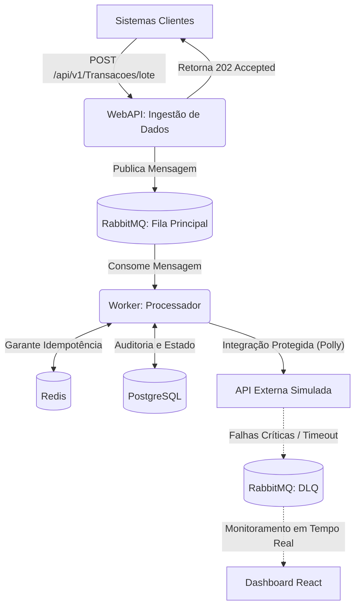

# Fiscal Middleware: Resiliência e Mensageria 


## Visão Geral do Projeto
Em ambientes corporativos de alta volumetria, integrações síncronas diretas com APIs externas (gateways de pagamento, emissão de notas fiscais, SEFAZ, etc.) frequentemente sofrem com instabilidades e timeouts, resultando em perda de dados e degradação da experiência do usuário.

Este middleware foi arquitetado para atuar como uma camada de **resiliência e mensageria**. A aplicação cliente recebe uma resposta imediata (`202 Accepted`) para não bloquear a thread principal, enquanto o processamento e a integração externa ocorrem de forma assíncrona. O uso de filas e políticas de resiliência garante tolerância a falhas e consistência de dados, mesmo durante indisponibilidades prolongadas do serviço terceiro.

---

## Arquitetura de Solução
O projeto utiliza os princípios de **Clean Architecture**, isolando o domínio das integrações de infraestrutura. A solução é dividida em dois microserviços principais:



---

## Decisões Técnicas e Trade-offs

- **Mensageria com RabbitMQ:** A substituição de chamadas HTTP síncronas por mensageria garante desacoplamento estrutural. A WebAPI apenas valida e enfileira (latência em milissegundos), delegando o processamento pesado ao Worker, o que permite escalar o consumo horizontalmente sem sobrecarregar a entrada de dados.
- **Resiliência de Integração (Polly):** O tráfego de saída do Worker utiliza políticas de `Retry` com `Backoff Exponencial` para absorver pequenas oscilações de rede (jitter). Adicionalmente, um `Circuit Breaker` é configurado para abrir após uma sequência de falhas consecutivas, prevenindo o esgotamento de recursos sistêmicos (resource exhaustion) e aliviando a carga no servidor de destino.
- **Persistência Relacional (PostgreSQL):** O banco de dados relacional, orquestrado via Entity Framework Core, é utilizado para auditoria de processamento, rastreamento de transações com falha e armazenamento seguro do estado atual da operação.
- **Monitoramento e UI:** O dashboard foi desenvolvido em React e Vite para proporcionar visibilidade técnica sobre o status das filas. O design utiliza UI minimalista (Glassmorphism), micro-gráficos para exibição de métricas (taxa de erro e sucesso) e atualizações em tempo real baseadas no polling de métricas da API.

---

## Instruções de Execução

O ambiente está totalmente containerizado (Docker Desktop e .NET 9 SDK requeridos).

### Inicialização da Infraestrutura
Na raiz do repositório, inicie os serviços base (PostgreSQL, RabbitMQ e Redis):
```bash
docker-compose up -d postgres rabbitmq redis
```
*(Aguarde alguns segundos até que todos os containers estejam saudáveis).*

### Inicialização dos Serviços
Abra três sessões de terminal para iniciar os serviços:

```bash
# Terminal 1: WebAPI (Porta 5074)
cd FiscalMiddleware.WebAPI
dotnet run

# Terminal 2: Worker de Processamento
cd FiscalMiddleware.Worker
dotnet run

# Terminal 3: Dashboard React (Porta 5173)
cd FiscalMiddleware.Panel
npm install && npm run dev
```

### URLs de Acesso
- **Documentação da API (Swagger):** [http://localhost:5074/swagger](http://localhost:5074/swagger)
- **Gerenciamento do RabbitMQ (guest/guest):** [http://localhost:15672](http://localhost:15672)
- **Painel de Monitoramento (React):** [http://localhost:5173](http://localhost:5173)

---

## Testando a Aplicação

Para validar o fluxo completo:

1. Acesse o **Dashboard React** no navegador.
2. Utilize o botão **"SIMULAR LOTE (50)"** na interface gráfica. Esta ação injetará 50 transações na WebAPI de forma assíncrona.
3. Como alternativa via linha de comando (cURL):

```bash
curl -X POST http://localhost:5074/api/v1/Transacoes/lote \
  -H "Content-Type: application/json" \
  -d '{
    "loteId": "a7050e2f-c4b1-4c1e-abf0-e4032baaf005",
    "origem": "SistemaVendas",
    "transacoes": [
      {
        "documentoFiscal": "NFE-9999",
        "cnpjEmitente": "12345678000199",
        "valor": 1500.50,
        "tipoOperacao": 1,
        "payloadOriginal": "{ \"itens\": [ { \"id\": 1, \"valor\": 1500.50 } ] }"
      }
    ]
  }'
```

**Comportamento do Circuit Breaker:** 
A simulação da API externa (`ExternalFiscalClient`) possui um percentual de falha injetado intencionalmente (30%). Durante o processamento de lotes grandes, é possível observar, via logs do Worker, as aberturas de circuito e as retentativas atuando na prática. As mensagens que não puderem ser processadas após a exaustão das políticas de retry serão devidamente roteadas para a **Dead Letter Queue (DLQ)**.

---

## Roadmap / Melhorias Futuras

Para adoção em escala de produção real, as seguintes evoluções arquiteturais estão no radar:
- **Camada de Segurança:** Inclusão de `OAuth2/mTLS` entre os sistemas clientes e a WebAPI.
- **Observabilidade Centralizada:** Integração do `OpenTelemetry` para geração de traces distribuídos entre WebAPI, filas e Worker, consolidando as métricas no Prometheus/Grafana.
- **Estratégia de Reprocessamento:** Adição de rotinas automatizadas (CronJobs) ou endpoints administrativos para reinjeção manual/assistida das mensagens estacionadas na DLQ.
